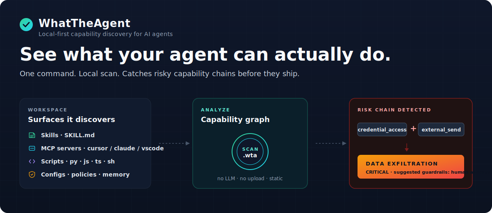
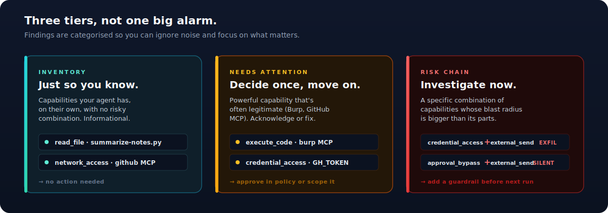

# WhatTheAgent

<p align="center">
  
</p>

<p align="center">
  <strong>Local-first capability discovery for AI agent workspaces.</strong><br/>
  Find what your skills, MCP servers, and scripts can <em>actually</em> do — and which combinations are dangerous.
</p>

<p align="center">
  <a href="https://www.npmjs.com/package/whattheagent"></a>
  <a href="LICENSE"></a>
  <a href="https://nodejs.org"></a>
  <a href="#tests"></a>
  <a href="#status"></a>
</p>

<p align="center">
  
</p>

## Why this exists

AI agent workspaces have grown from "one Claude Code skill" into sprawling combinations of skills, MCP servers, scripts, plugins, and policies. Each surface looks fine alone. The risk is in the **combinations**:

- A skill that can read `.env` files. *Fine.*
- A skill that can POST to webhooks. *Fine.*
- The same skill can do **both**. **That's the shape of credential exfiltration**, regardless of intent.

Existing tools don't catch this. SAST scans your code. SCA scans your dependencies. Neither understands what your *agent* can do once you give it a skill, an MCP server, and a script. There's no good answer to *"my agent has these 47 capabilities — what should I worry about?"*

WhatTheAgent is that answer. One command surfaces the **capability chains** that matter — `credential_access + external_send → Data Exfiltration`, `execute_code + network_access → Remote Execution` — with the exact files and lines, plus a one-shot way to acknowledge intentional ones (`wta ack`) so future scans only flag what changed.

```bash
npm install -g whattheagent
wta understand . --chat            # phone-readable summary
wta understand . --output .wta --open   # local HTML report
```

- **Catches what single-capability scanners miss.** Each tool sees one risk; chains are emergent.
- **Local and static.** No login, no upload, no LLM, no script execution, no MCP server startup.
- **Built for AI workflows.** Emits human HTML, agent-readable JSON, a chat-friendly summary for personal agents, and a fix plan for Codex / Claude Code / Cursor / OpenClaw / Hermes.

## How it looks

<p align="center">
  
</p>

## What you'll see

<p align="center">
  
</p>

WhatTheAgent doesn't dump every capability into one big alarm list. Findings land in one of three tiers:

- **Inventory** — "your skill reads files." Useful to know, no action needed.
- **Needs attention** — "your agent has Burp wired up via MCP." Often legitimate, but you should *acknowledge* it once. Approve in policy or scope it down.
- **Risk chain** — "this skill can read `.env` AND post to a webhook." That's the data-exfil shape, regardless of intent. Add a guardrail before the next run.

The point isn't to flag everything. The point is to make *intentional* capabilities cheap to acknowledge and *unintentional* combinations impossible to miss.

### "Is Burp risky? It's a legitimate tool."

Yes — and yes. The flag is correct: Burp Suite *can* execute code and *does* access the network, and an LLM driving it has a remote-execution-capable tool one prompt away. WhatTheAgent surfaces it under **Needs attention**, not as malicious. Acknowledge it once in [your policy file](#policy):

```yaml
expected:
  - component: "mcp.burp"
    capability: "execute_code"
    reason: "Burp Suite MCP — security testing tool, intentional."
```

After that, Burp moves to "Expected" and only **changes** to its capabilities reappear.

## Install and run

```bash
npm install -g whattheagent
wta understand . --output .wta --open    # write report.html and open it
wta plan . --for-codex                   # hand a fix plan to your coding agent
```

Sanity check: `wta --help` (or the longer `whattheagent --help`) lists every command. Node 20 or newer.

## Choose your path

WhatTheAgent has two modes:

| Mode | Use this for | Start here |
|---|---|---|
| Personal agents | OpenClaw, Hermes, local skills, memory, scripts, MCP servers | [Personal Agents](readme/personal-agents.md) |
| Workspace stations | Codex, Claude Code, Cursor, Kiro, Windsurf, VS Code, team repos | [Workspace Stations](readme/workspace-stations.md) |
| Agent instructions | Paste into Claude, Codex, OpenClaw, Hermes, or another agent | [Agent Instructions](readme/agent-instructions.md) |
| GitHub Actions | CI reports for PRs and agent workspaces | [GitHub Actions](docs/github-action.md) |

The full docs hub is in [readme/](readme/README.md).

Core loop:

```text
User understands and approves.
Agent implements.
WhatTheAgent verifies.
```

## Drop into an agent

Two ways:

```bash
wta instructions --for-claude     # or --for-codex / --for-openclaw / --for-hermes
```

…produces a copy-paste prompt that tells your agent to baseline, summarize, suggest guardrails, and re-check whenever something changes.

A ready-made Hermes / OpenClaw skill lives at [skills/whattheagent-safety-check.skill.md](skills/whattheagent-safety-check.skill.md). It orchestrates `wta diff-baseline --chat`, posts the message verbatim to the user, and translates approve / guardrail / remove replies into `wta ack` (or `wta ack-batch` for "approve all").

## GitHub Actions

Run WhatTheAgent in CI and upload the local `.wta` report:

```yaml
name: WhatTheAgent

on:
  pull_request:
  push:
    branches: [main]

jobs:
  whattheagent:
    runs-on: ubuntu-latest
    steps:
      - uses: actions/checkout@v4
      - uses: actions/setup-node@v4
        with:
          node-version: 20
      - run: npm install -g whattheagent
      - run: wta understand . --output .wta --json --no-color
      - run: wta instructions --for-codex --output .wta/codex-instructions.md
      - uses: actions/upload-artifact@v4
        with:
          name: whattheagent-report
          path: .wta/
```

A reusable example lives at:

```text
examples/github-action/whattheagent.yml
```

## Development From Source

```bash
git clone https://github.com/Rosh1106/WhatTheAgent.git
cd WhatTheAgent
npm install
npm run build
npm link
```

Local development without linking:

```bash
npm install
npm run build
npm run dev -- scan examples/risky-agent
npm run dev -- instructions --for-claude
```

Both binaries work after global install or linking:

```bash
whattheagent scan .
wta scan .
```

## Commands

Core commands:

```bash
wta understand . --output .wta
wta compatibility
wta instructions --for-claude
wta plan . --for-codex
wta graph . --json
wta diff old.json new.json
```

Personal-agent approval flow:

```bash
wta understand . --profile hermes --output .wta
wta baseline . --profile hermes --output .wta
wta diff-baseline . --profile hermes --output .wta
wta init-policy . --profile openclaw
```

Agent-friendly flags:

```bash
wta understand . --json --no-color --quiet --output .wta
```

Skip extra paths beyond the built-in defaults:

```bash
wta understand . --exclude vendor --exclude '**/*.generated.*'
wta understand . --exclude vendor,scratch,**/build/**
```

`--exclude` is repeatable, comma-separated, and accepts either a bare directory name (auto-wrapped to `**/<name>/**`) or any glob. Defaults already skip `node_modules`, `dist`, `.venv`, `__pycache__`, `.claude/plugins/marketplaces`, `.claude/plugins/cache`, and similar caches.

Open the rendered HTML report directly after a scan:

```bash
wta understand . --open
```

## Acknowledge intentional capabilities

After your first scan, expect to see entries that are powerful but intentional (Burp MCP, GitHub MCP, your CI release script). Two ways to move them out of *Needs attention* and into *Expected*:

```bash
# Bulk: scan once and seed wta.policy.yaml with every detected capability as expected.
wta init-policy . --from-scan --profile personal-agent

# Targeted: ack a single component (or a single capability of one).
wta ack mcp.burp execute_code --reason "Burp Suite, security testing tool"
wta ack mcp.github --reason "Read-only GitHub MCP, approved"
```

Without an explicit capability, `wta ack` reads the current scan and acknowledges every capability that component has. Re-running an ack is a no-op — duplicates are detected by `(component, capability)`.

For agent integrations that compose the reason at runtime (and want to avoid shell-quoting headaches), pipe it on stdin instead of passing `--reason`:

```bash
echo "internal finance pipeline, sends invoices to staging webhook" \
  | wta ack skill.invoice-review --reason-from-stdin
```

To approve many components in one call (the "approve all" intent from the chat skill), pipe a JSON array to `wta ack-batch`:

```bash
cat <<'JSON' | wta ack-batch --reason "approved during onboarding"
[
  { "componentId": "mcp.burp" },
  { "componentId": "skill.invoice-review", "capability": "external_send", "reason": "specific override" },
  { "componentId": "mcp.github" }
]
JSON
```

Each item may set its own `capability` and `reason`; otherwise it inherits the batch `--reason` and fans out to every capability detected for that component. Output reports added / already-present / skipped counts (`--json` returns the structured form for the agent to log).

## Chat-style summary for personal agents (Hermes / OpenClaw / Telegram bots)

If your agent talks to you over chat, `report.html` is the wrong UI. Use `--chat`:

```bash
wta understand .  --chat            # phone-readable markdown to stdout
wta understand .  --chat --json     # structured { message, items[], actions } for the agent
wta diff-baseline . --chat --json   # same shape, only newly added skills
```

The chat output looks like this:

```
🔴 1 new skill · 1 new risk chain

invoice-review (Skill)
   skills/invoice-review/SKILL.md
   credential_access → external_send
   data exfiltration
   Component can read credentials and send data externally.

What do you want to do?
   ✅ approve — I trust this, add to policy
   🛡  guardrail — require approval / scope it down
   🚫 remove — delete it
```

Both files also land at `.wta/chat-message.md` (the markdown above) and `.wta/chat-actions.json` (per-item `{approve, guardrail, remove}` commands keyed to `wta ack`).

A ready-to-drop-in skill that orchestrates this conversation is at [skills/whattheagent-safety-check.skill.md](skills/whattheagent-safety-check.skill.md). It tells the agent: run `wta diff-baseline --chat --json`, post `message` verbatim to the user, listen for "approve / guardrail / remove" intent, and run the matching command from `actions[]`. It explicitly forbids approving without a user reason, deleting files, or paraphrasing the message — the chat output is already designed to fit a phone screen.

`understand` writes:

```text
.wta/
  understand.json
  capability-graph.json
  fix-plan.md
  report.html
  agent-context.json
```

The report is split into:

- detected setup
- what your agent can do
- needs attention
- expected or acknowledged capabilities
- suggested fixes
- coding-agent fix plan

MCP servers are shown directly as MCP servers in reports and summaries.

For the current known-client path table, see [Compatibility](readme/compatibility.md).

## Workspace Detection

WhatTheAgent automatically detects workspace surfaces from files it can see:

- generic MCP: `.mcp.json`, `mcp.json`
- Cursor MCP: `.cursor/mcp.json`
- VS Code MCP: `.vscode/mcp.json`
- Claude Desktop MCP: `claude_desktop_config.json`
- skills: `SKILL.md`
- scripts: `scripts/**/*.py|js|ts|sh`
- policy: `wta.policy.yaml`, `.wta/policy.*`
- CI: GitHub workflows that run `wta` or `whattheagent`

The client list is intentionally simple: WhatTheAgent checks known config and skills paths, parses MCP server configs when present, and reports only the surfaces it can prove from local files.

List known client paths:

```bash
wta compatibility
wta compatibility --json
```

## Continuous Check Loop

For personal agents:

```bash
wta baseline . --profile personal-agent --output .wta
wta diff-baseline . --profile personal-agent --output .wta
```

Run the diff daily, or whenever a new skill or MCP server is added. The agent instruction should summarize new capabilities and ask whether to accept them or add guardrails.

## Policy

```yaml
expected:
  - component: "mcp.github-readonly"
    capability: "network_access"
    reason: "GitHub read-only MCP server needs network access to api.github.com."
```

Policy does not hide inventory. It moves approved capabilities out of "needs attention" so users can focus on real changes.

## Static and Local First

WhatTheAgent runs locally. It does not require login, upload scan data, call an API, use an LLM, execute scripts, or start MCP servers.

Advanced preview commands live in the roadmap:

```bash
wta probe .
wta runtime . --mode observe
```

## Example

```bash
npm run dev -- understand examples/risky-agent --output .wta
npm run dev -- plan examples/risky-agent --for-codex
npm run dev -- baseline examples/hermes-personal-agent --profile hermes --output .wta
npm run dev -- instructions --for-claude
```

The example workspace intentionally triggers:

- `external_send`
- `credential_access`
- `execute_code`
- `network_access`
- data exfiltration and remote execution risk chains

Additional fixtures cover common review cases:

```bash
npm run dev -- understand examples/benign-agent
npm run dev -- understand examples/cursor-agent
npm run dev -- understand examples/claude-desktop-agent
npm run dev -- understand examples/vscode-agent
npm run dev -- understand examples/expected-github-tool
npm run dev -- understand examples/risky-finance-agent
npm run dev -- understand examples/critical-payment-agent
```

- `benign-agent` shows low-noise inventory and ordinary observations
- `expected-github-tool` shows an expected MCP server declared by policy
- `risky-finance-agent` triggers credential plus external-send risk
- `critical-payment-agent` triggers payment and order-placement risk

## Status

WhatTheAgent is **pre-1.0**. The CLI surface, scan output schema, and policy YAML format may still change. Detection patterns will tighten over time as more workspaces are scanned and false-positive cases are reported.

What's stable today:
- `wta understand`, `wta scan`, `wta graph`, `wta diff`
- `wta plan`, `wta instructions`, `wta compatibility`
- `wta init-policy`, `wta ack`, `wta ack-batch`
- `wta baseline`, `wta diff-baseline`
- `--chat`, `--open`, `--exclude`, `--from-scan`, `--reason-from-stdin`
- The HTML report, SVG visual chains, and chat-summary output formats

What's still preview-only:
- `wta probe` (sandbox capability probing — emits a plan, doesn't execute)
- `wta runtime` (runtime observability — emits a plan, doesn't enforce)

See [docs/ROADMAP.md](docs/ROADMAP.md) for what's planned next.

## Tests

```bash
npm install
npm test           # 173 tests, ~700ms
npm run typecheck
npm run build
```

Test coverage includes risk classification, chain detection, sensitivity scoring, finding lifecycle, MCP and skill parsers, secret redaction, SVG and HTML report stability (with HTML-injection escape), the chat-summary builder, the policy-mutation engine (ack + ack-batch), and end-to-end scans of the example fixtures.

## Contributing

WhatTheAgent is open to contributions. Start with [CONTRIBUTING.md](CONTRIBUTING.md) — it has the dev setup, the test rules ("no PR without a regression test for whatever you fixed or added"), and the commit-style guide.

If you have a security report, please follow [SECURITY.md](SECURITY.md) instead of opening a public issue.

For day-to-day questions, the [readme/](readme/) directory has audience-specific docs:

- [readme/personal-agents.md](readme/personal-agents.md) — for OpenClaw / Hermes / personal-agent users
- [readme/workspace-stations.md](readme/workspace-stations.md) — for Codex / Claude Code / Cursor / VS Code repos
- [readme/agent-instructions.md](readme/agent-instructions.md) — copy-paste prompts for agents
- [readme/compatibility.md](readme/compatibility.md) — known-client paths and MCP config locations

## License

[MIT](LICENSE).
